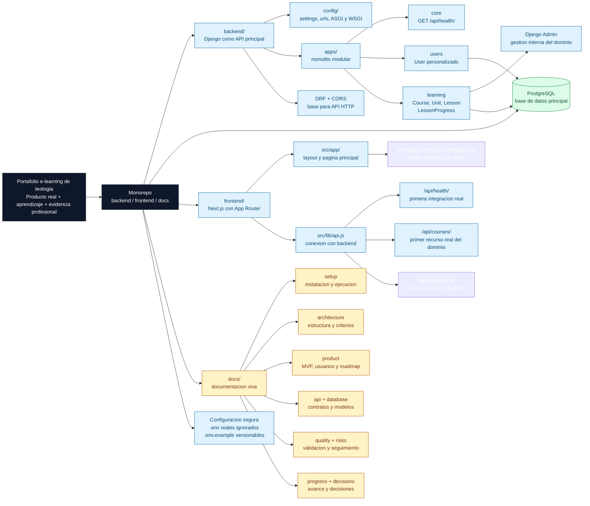

# Portafolio E-learning de Teologia

## Estado del proyecto

Proyecto en construccion activa.

Este repositorio muestra una base tecnica real ya funcional, pero el producto todavia esta en desarrollo. La idea no es presentar una plataforma terminada, sino evidenciar criterio de construccion, avance progresivo, documentacion viva y decisiones de ingenieria bien cuidadas.

Aplicacion fullstack orientada al aprendizaje progresivo de Biblia y teologia evangelica. El proyecto busca combinar una experiencia de estudio clara y amigable con una base tecnica bien documentada, mantenible y extensible.

Ademas de su proposito funcional, este repositorio tambien sirve como portafolio profesional para demostrar criterios de ingenieria de software, organizacion de arquitectura, documentacion tecnica y buenas practicas de desarrollo.

## Resumen del proyecto

- Backend: Django
- Frontend: Next.js
- Base de datos: PostgreSQL
- Arquitectura: backend y frontend separados dentro del mismo repositorio
- Estado actual: proyecto en construccion, con base tecnica inicial operativa y documentacion estructurada

## Mapa visual del proyecto



Este mapa se lee como un arbol de entrada al repositorio. Desde la raiz se ve que el proyecto esta organizado como monorepo con tres areas principales: backend, frontend y documentacion. Las ramas muestran que ya existe una base tecnica real con Django, Next.js, PostgreSQL, modelos del dominio `learning`, admin y una primera conexion HTTP.

## Estado actual

Hoy el repositorio contiene una base solida sobre la cual seguir construyendo:

- Un proyecto Django funcional en `backend/`
- Una base API inicial con Django REST Framework y CORS configurado
- Un endpoint tecnico de salud en `backend/apps/core/` accesible en `/api/health/`
- Un primer endpoint de negocio en `backend/apps/learning/` accesible en `GET /api/courses/`
- Un endpoint de detalle de curso en `backend/apps/learning/` accesible en `GET /api/courses/{id}/`
- Una primera conexion real entre Next.js y Django desde `frontend/src/app/page.js`
- Una primera integracion del frontend con un recurso real del dominio mostrando cursos publicados
- Una pagina dinamica de detalle de curso en `frontend/src/app/courses/[courseId]/page.js`
- Un modelo de usuario personalizado en `backend/apps/users/models.py`
- Una app local `learning` registrada para alojar el nucleo inicial del dominio del MVP
- El nucleo del dominio del MVP ya implementado en `backend/apps/learning/models.py` con `Course`, `Unit`, `Lesson` y `LessonProgress`
- Configuracion de PostgreSQL mediante variables de entorno
- Un frontend Next.js con App Router en `frontend/`
- Una estructura documental en `docs/` para setup, producto, arquitectura, API, base de datos, calidad, riesgos, progreso, decisiones tecnicas y plantillas reutilizables

Todavia no existe una interfaz funcional completa del producto ni una API de dominio cerrada. En `learning`, el nucleo del dominio ya esta modelado en base de datos y ya tiene lectura de cursos publicados y detalle de curso con unidades y lecciones, mientras el resto de la capa API y la experiencia completa de aprendizaje siguen en construccion. La documentacion distingue explicitamente entre lo implementado y lo planificado para evitar ambiguedades.

Si quieres revisar el avance cronologico y retomar rapidamente el proyecto, consulta [docs/progress/README.md](./docs/progress/README.md).

## Estructura del repositorio

```text
Portafolio/
|-- backend/
|-- frontend/
|-- docs/
|-- .gitignore
`-- README.md
```

- `backend/`: proyecto Django, configuracion, modelos y base API
- `frontend/`: aplicacion Next.js y futura interfaz de usuario
- `docs/`: documentacion tecnica y operativa del proyecto

## Primeros pasos

1. Revisa los prerrequisitos en [docs/setup/prerequisites.md](./docs/setup/prerequisites.md).
2. Configura el backend siguiendo [backend/README.md](./backend/README.md).
3. Configura el frontend siguiendo [frontend/README.md](./frontend/README.md).
4. Completa las variables de entorno usando `backend/.env.example` y `frontend/.env.example`.
5. Ejecuta ambos servicios con la guia de [docs/setup/run-project.md](./docs/setup/run-project.md).

## Documentacion

La documentacion del proyecto esta organizada por dominios:

- [docs/README.md](./docs/README.md): mapa general de la documentacion
- [docs/setup/README.md](./docs/setup/README.md): instalacion, configuracion y ejecucion local
- [docs/product/README.md](./docs/product/README.md): vision funcional, usuarios, MVP y roadmap del producto
- [docs/architecture/README.md](./docs/architecture/README.md): contexto, estructura y criterios de arquitectura
- [docs/database/README.md](./docs/database/README.md): modelos, migraciones y lineamientos de datos
- [docs/api/README.md](./docs/api/README.md): estado y diseno previsto de la API
- [docs/quality/README.md](./docs/quality/README.md): estrategia de QA, validacion y criterios de cierre
- [docs/risks/README.md](./docs/risks/README.md): riesgos tecnicos y de proyecto, mitigaciones y seguimiento
- [docs/progress/README.md](./docs/progress/README.md): avance del proyecto y bitacora de trabajo
- [docs/decisions/README.md](./docs/decisions/README.md): decisiones tecnicas registradas
- [docs/templates/README.md](./docs/templates/README.md): plantillas reutilizables para mantener consistencia documental

## Seguridad y configuracion

Los archivos con secretos reales no se versionan. La configuracion local se define mediante archivos de entorno:

- `backend/.env`
- `frontend/.env.local`

Los archivos `*.env.example` si se mantienen en el repositorio como referencia de configuracion.

## Objetivo documental

La documentacion de este proyecto se mantiene como documentacion viva. Cada cambio relevante en estructura, setup, arquitectura o contratos tecnicos deberia reflejarse en los documentos correspondientes.
