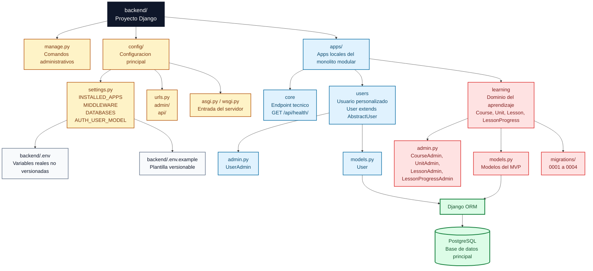
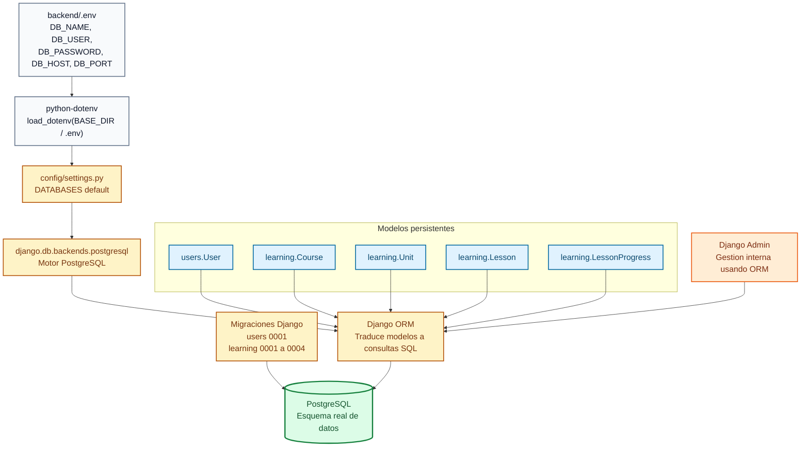
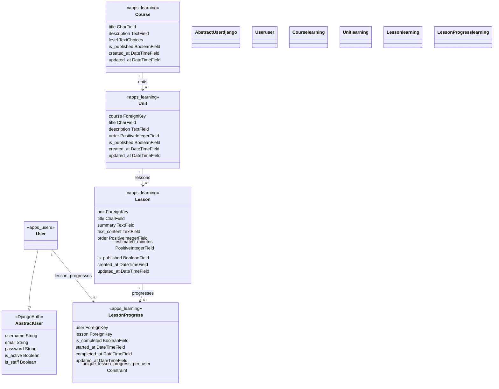

# Diagramas del backend

Este documento muestra, de forma visual, como esta organizado Django dentro del backend y como se conecta con PostgreSQL.

El objetivo no es documentar todo el producto, sino ayudar a entender rapidamente:

- donde vive la configuracion principal de Django;
- como se organizan las apps locales;
- que partes del backend llegan a la base de datos;
- que modelos reales existen hoy en PostgreSQL.

## Flowchart de organizacion de Django

Este diagrama muestra la estructura interna del backend Django. La lectura recomendada es de arriba hacia abajo: primero la entrada del proyecto, luego la configuracion global, despues las apps locales y finalmente la persistencia.

Lectura rapida: `config/` define como arranca Django y que apps estan registradas. `apps/` concentra las apps locales. `users` y `learning` llegan a PostgreSQL mediante el ORM porque contienen modelos persistentes. `core` existe como app tecnica y hoy expone el endpoint de salud, pero no define modelos propios.

## Flowchart de conexion Django - PostgreSQL

Este diagrama muestra como Django obtiene la configuracion de base de datos y como los modelos terminan persistiendo informacion en PostgreSQL.

Lectura rapida: Django no tiene credenciales hardcodeadas. `settings.py` carga variables desde `backend/.env`, configura `DATABASES` y usa el backend PostgreSQL de Django. Los modelos de `users` y `learning` se comunican con PostgreSQL a traves del ORM, y las migraciones versionadas definen el esquema.

## Class Diagram de modelos Django

Este diagrama muestra los modelos Django que hoy se transforman en tablas mediante migraciones y ORM. No incluye entidades futuras ni endpoints.

Lectura rapida: la estructura principal del aprendizaje es `Course -> Unit -> Lesson`. El avance del usuario no se guarda directamente en `Lesson`, sino en `LessonProgress`, que conecta un usuario con una leccion y evita duplicados por usuario y leccion mediante una restriccion unica.

## Limite de estos diagramas

Estos mapas muestran el backend real actual. No representan endpoints de negocio, serializers, permisos ni flujos completos de producto porque esas piezas todavia no estan implementadas.
