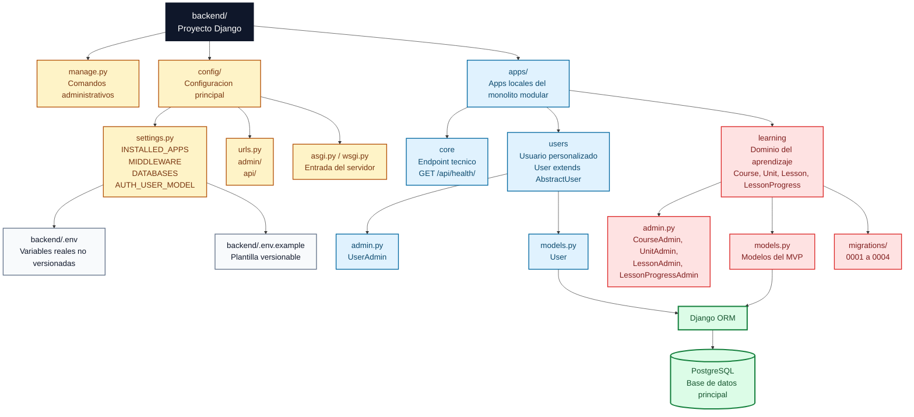

# Backend

Backend principal del proyecto, construido con Django, Django REST Framework y PostgreSQL. Su responsabilidad es concentrar la logica de negocio, la persistencia de datos, la autenticacion del sistema y la API que consumira el frontend.

## Alcance actual

Actualmente el backend incluye:

- Proyecto Django base en `backend/config/`
- App local `core` en `backend/apps/core/` para endpoints transversales
- App local `users` en `backend/apps/users/`
- App local `learning` en `backend/apps/learning/` para alojar el nucleo del dominio del MVP
- Modelo de usuario personalizado basado en `AbstractUser`
- Nucleo inicial del dominio implementado con `Course`, `Unit`, `Lesson` y `LessonProgress`
- Configuracion de base de datos PostgreSQL mediante variables de entorno
- Django REST Framework registrado para construir endpoints API
- `django-cors-headers` configurado para permitir solicitudes desde `http://localhost:3000`
- Endpoint tecnico de salud disponible en `/api/health/`
- Ruta del panel administrativo de Django en `/admin/`

Todavia no existen endpoints de negocio. El unico endpoint API implementado por ahora es el de verificacion tecnica de salud.

La app `learning` ya esta creada y registrada en Django. Hoy concentra el nucleo del dominio del MVP a nivel de modelos, pero todavia no expone endpoints propios.

## Estructura relevante

```text
backend/
|-- apps/
|   |-- core/
|   |-- learning/
|   `-- users/
|-- config/
|-- .env.example
|-- DIAGRAMS.md
|-- manage.py
|-- requirements.txt
`-- README.md
```

- `apps/`: aplicaciones locales del dominio
- `config/`: configuracion global del proyecto Django
- `DIAGRAMS.md`: mapas visuales de la organizacion de Django y su conexion con PostgreSQL
- `manage.py`: punto de entrada para comandos administrativos
- `requirements.txt`: dependencias del backend

## Flowchart de organizacion de Django

Este diagrama muestra la estructura interna del backend Django. La lectura recomendada es de arriba hacia abajo: primero la entrada del proyecto, luego la configuracion global, despues las apps locales y finalmente la persistencia.



Lectura rapida: `config/` define como arranca Django y que apps estan registradas. `apps/` concentra las apps locales. `users` y `learning` llegan a PostgreSQL mediante el ORM porque contienen modelos persistentes. `core` existe como app tecnica y hoy expone el endpoint de salud, pero no define modelos propios.

## Configuracion local

Desde `backend/`, crea y activa un entorno virtual:

```powershell
crea: python -m venv .venv
activa: .venv\Scripts\activate
desactiva: deactivate
```

Instala dependencias:

```powershell
pip install -r requirements.txt
```

Copia `backend/.env.example` a `backend/.env` y completa los valores reales de tu entorno local.

## Ejecucion

Con el entorno virtual activo y la base de datos disponible:

```powershell
python manage.py migrate
python manage.py check
python manage.py runserver
```

El servidor de desarrollo queda disponible en [http://127.0.0.1:8000/](http://127.0.0.1:8000/).

Verificaciones utiles:

- panel administrativo: [http://127.0.0.1:8000/admin/](http://127.0.0.1:8000/admin/)
- endpoint de salud API: [http://127.0.0.1:8000/api/health/](http://127.0.0.1:8000/api/health/)
- migraciones de `learning`: `python manage.py showmigrations learning`

## Variables de entorno

El backend carga variables desde `backend/.env` usando `python-dotenv` dentro de `backend/config/settings.py`.

Variables requeridas:

- `SECRET_KEY`
- `DEBUG`
- `ALLOWED_HOSTS`
- `DB_NAME`
- `DB_USER`
- `DB_PASSWORD`
- `DB_HOST`
- `DB_PORT`

Nunca se deben subir secretos reales al repositorio. El archivo versionado debe ser siempre `backend/.env.example`.

## Modelo de usuario

El modelo actual se define en `backend/apps/users/models.py` y extiende `AbstractUser`:

```python
class User(AbstractUser):
    pass
```

Tomar esta decision al inicio evita migraciones complejas mas adelante si el proyecto necesita extender el perfil de usuario.

## Nucleo del dominio

En `backend/apps/learning/models.py` hoy existen:

- `Course`
- `Unit`
- `Lesson`
- `LessonProgress`

Detalle relevante:

- `Lesson` usa `text_content` en lugar de un campo generico `content`

Esto permite modelar el contenido textual actual sin cerrar la puerta a soportar otros tipos de contenido en el futuro.

## Registro administrativo del dominio

En `backend/apps/learning/admin.py` ya estan registrados en el panel administrativo de Django:

- `Course`
- `Unit`
- `Lesson`
- `LessonProgress`

Estado real implementado:

- `CourseAdmin` mejora el listado con columnas de titulo, nivel, publicacion y marcas de tiempo; tambien agrega filtros, busqueda por titulo y descripcion, y orden alfabetico por titulo.
- `UnitAdmin` agrega columnas para curso y orden, filtros por curso y estado de publicacion, busqueda por titulo, descripcion y titulo del curso, y orden por curso, orden e id.
- `LessonAdmin` agrega columnas para unidad, orden y duracion estimada, filtros por unidad y publicacion, busqueda por titulo, resumen, contenido textual, unidad y curso, y orden por unidad, orden e id.
- `LessonProgressAdmin` agrega columnas para usuario, leccion y estado de completitud, filtros por completitud y marcas de tiempo, busqueda por usuario y jerarquia de la leccion, y orden descendente por actualizacion.

Esto significa que el dominio ya no solo existe como modelos y migraciones: tambien cuenta con una configuracion administrativa base para facilitar carga, consulta y seguimiento desde `/admin/`.

## API y comunicacion local

La base de la API ya esta preparada con estas piezas:

- `rest_framework` en `INSTALLED_APPS`
- `corsheaders` en `INSTALLED_APPS`
- `corsheaders.middleware.CorsMiddleware` al inicio de `MIDDLEWARE`
- `CORS_ALLOWED_ORIGINS = ["http://localhost:3000"]`
- prefijo `api/` conectado en `backend/config/urls.py`

Esto permite que el frontend en `http://localhost:3000` pueda consumir endpoints del backend en `http://127.0.0.1:8000` cuando se avance con la integracion real.

## Referencias relacionadas

- [DIAGRAMS.md](./DIAGRAMS.md)
- [docs/setup/backend.md](../docs/setup/backend.md)
- [docs/api/health.md](../docs/api/health.md)
- [docs/database/models.md](../docs/database/models.md)
- [docs/architecture/modules.md](../docs/architecture/modules.md)
