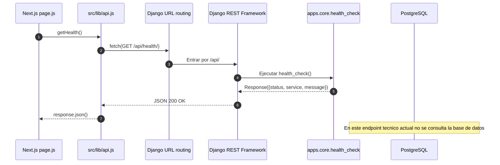
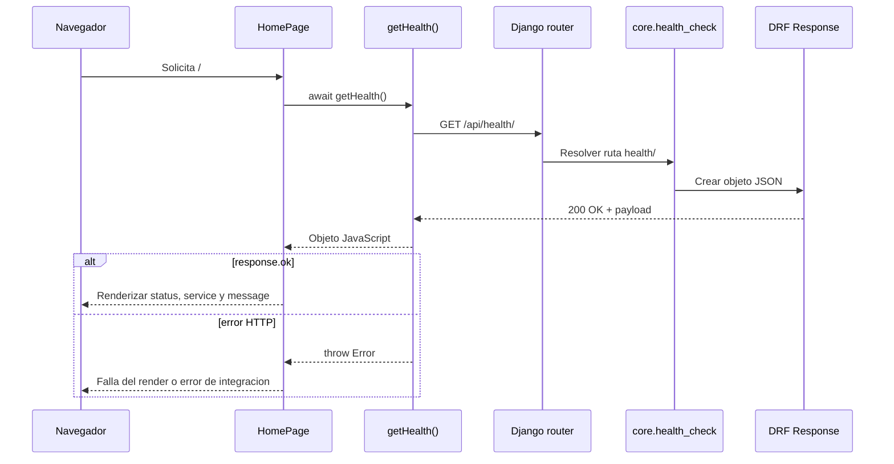
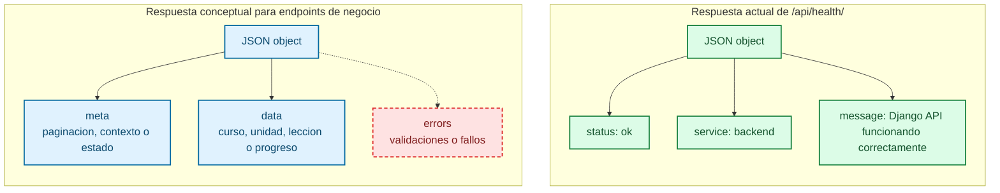
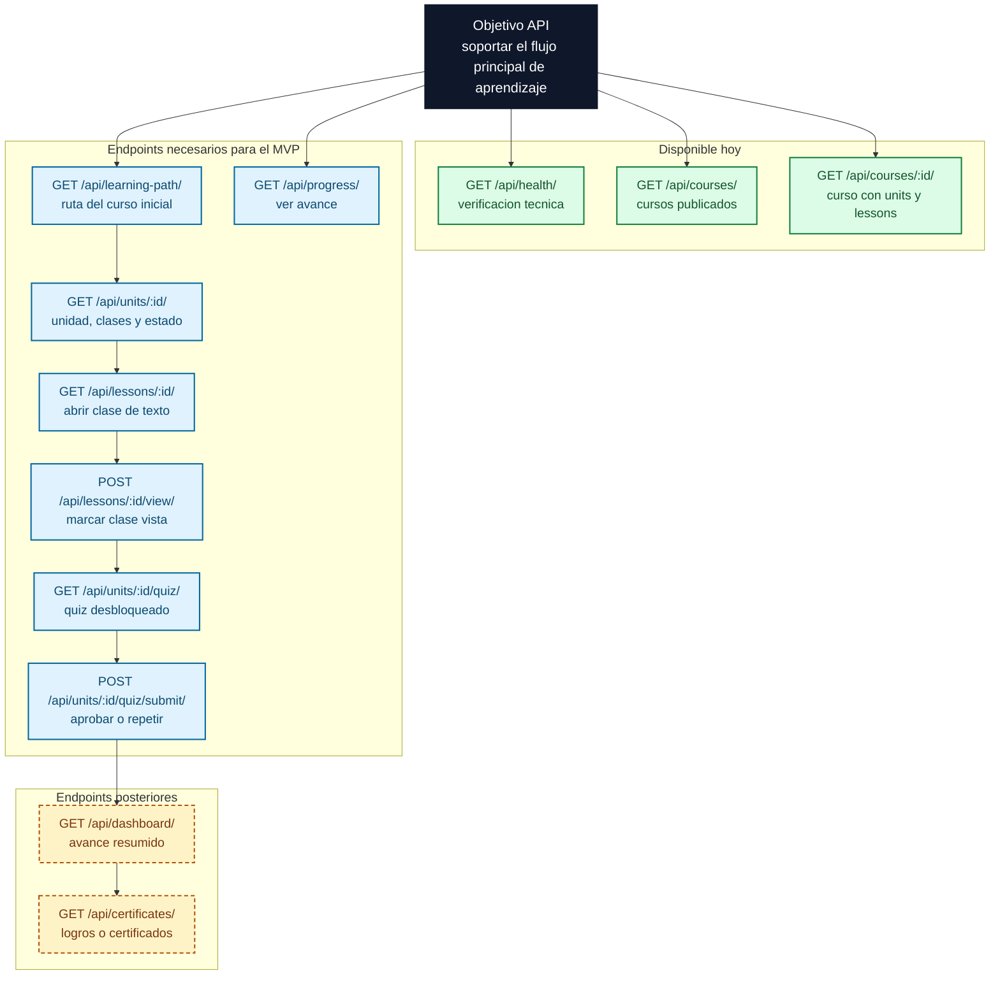

# Diagramas de API

Este documento resume visualmente como fluye hoy la integracion entre frontend y backend, como se organiza conceptualmente una respuesta JSON y que requisitos deberian cumplir los endpoints principales cuando la API de negocio exista.

Los diagramas distinguen entre:

- flujos ya implementados: `GET /api/health/`, `GET /api/courses/` y `GET /api/courses/{id}/`;
- estructura conceptual de respuestas JSON;
- direccion de endpoints necesarios para el MVP y extensiones posteriores.

## Sequence Diagram

Este diagrama muestra un flujo real ya implementado desde Next.js hasta Django REST Framework y su salida hacia el frontend.

Lectura rapida: `page.js` delega la llamada HTTP a `api.js`, Django enruta la peticion hacia `apps.core`, y DRF devuelve un JSON simple. PostgreSQL aparece en el diagrama para dejar claro que no toda respuesta API necesita tocar la base de datos.

## Sequence Diagram alternativo

Esta vista alternativa usa una secuencia mas detallada y cercana a lectura UML tradicional.

Lectura rapida: la idea central es que el frontend no conoce el detalle interno de Django; solo consume contratos HTTP/JSON mediante helpers como `getHealth()`, `getCourses()` y `getCourseDetail()`.

## Flowchart de estructura JSON

Este diagrama muestra la estructura conceptual de respuestas JSON. No representa un esquema JSON formal, sino una vista clara de como pensar los paquetes de datos.

Lectura rapida: la respuesta real actual es minima y plana. Para la API de negocio, conviene pensar desde ya en una estructura consistente donde `data` lleve el recurso principal y `errors` cubra validaciones y fallos.

## Flowchart de requisitos de endpoints

Este diagrama muestra el flujo y dependencia de los endpoints principales que el proyecto necesitara para cubrir el MVP documentado.

Lectura rapida: hoy existen `GET /api/health/`, `GET /api/courses/` y `GET /api/courses/:id/`. Para que el MVP funcione, la API todavia necesita ruta inicial de aprendizaje, detalle de unidad con estado de progreso, lectura de clase dedicada, marcado de clase vista, quiz de unidad y envio de respuestas. Dashboards y certificados quedan como extensiones posteriores.

## Limite actual

Estos diagramas muestran una mezcla intencional entre estado real y direccion futura:

- implementado hoy: `GET /api/health/`, `GET /api/courses/`, DRF, CORS y consumo desde Next.js;
- implementado hoy: `GET /api/courses/{id}/` con units y lessons anidados y consumo desde una ruta dinamica de Next.js;
- previsto para el MVP: endpoints de ruta inicial, unidad con progreso, lecciones, progreso y quiz;
- previsto despues: dashboards completos, certificados y funcionalidades avanzadas.
