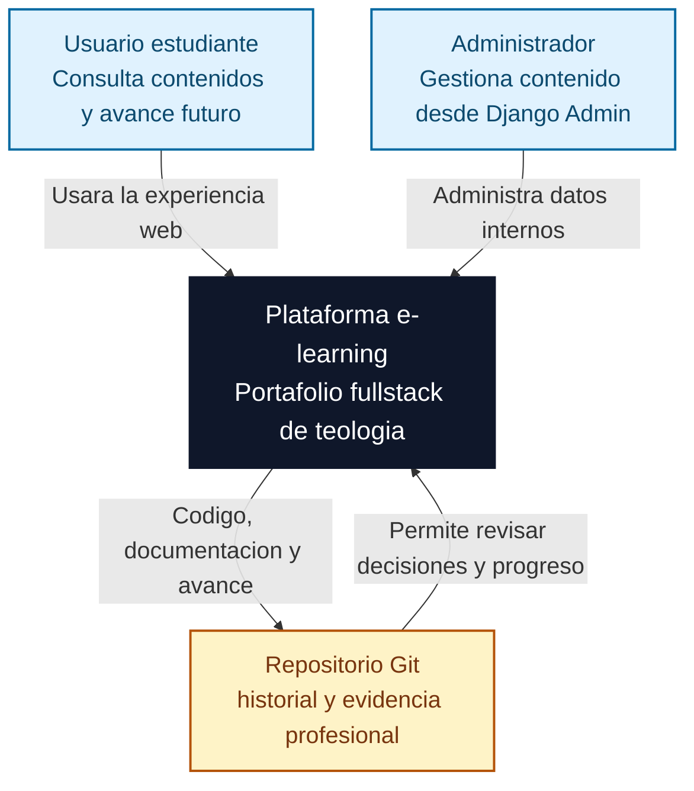
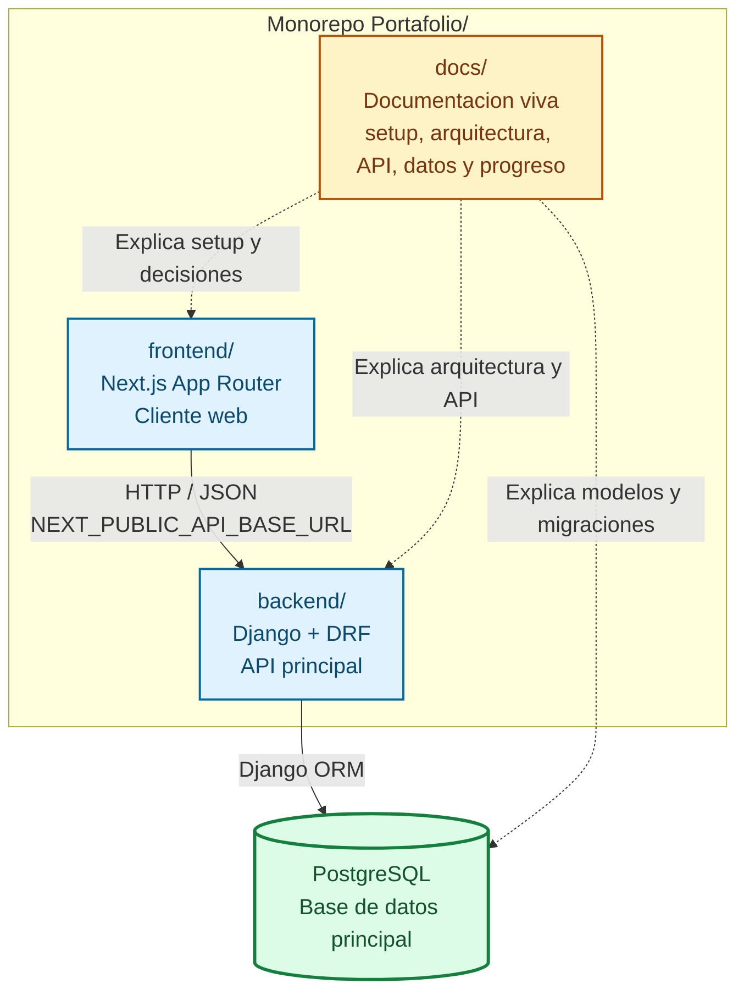
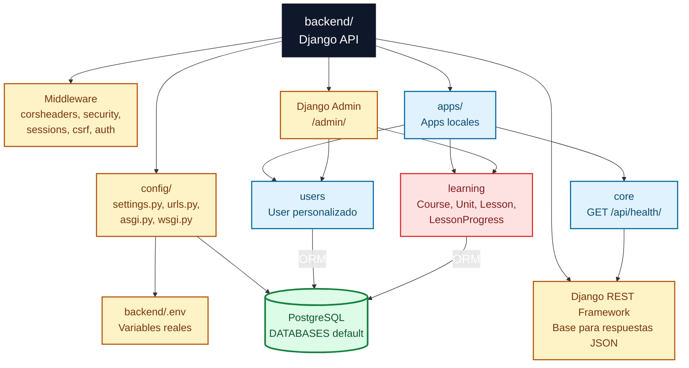
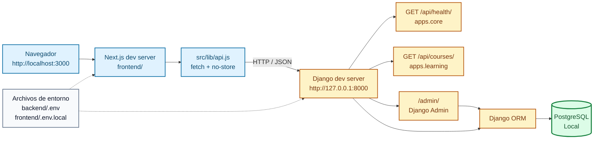
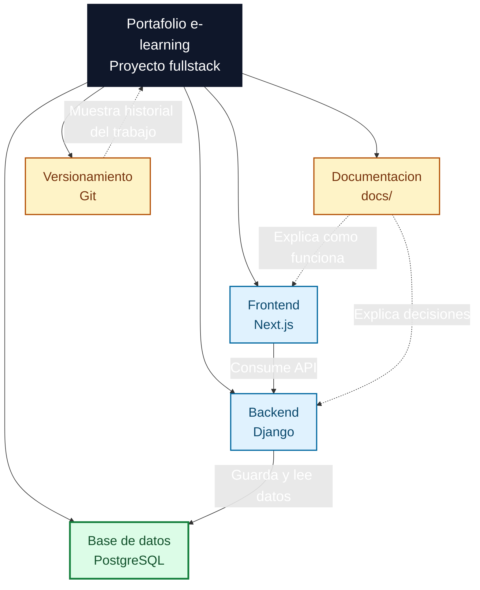

# Diagramas de arquitectura

Este documento resume visualmente la arquitectura actual del proyecto. Los diagramas muestran el estado real: monorepo con frontend Next.js, backend Django, PostgreSQL y documentacion viva.

Las vistas se enfocan en contexto, contenedores, componentes internos y comunicacion tecnica entre servicios.

## Flowchart de contexto del sistema

Vista de contexto: muestra quienes interactuan con el proyecto y que rol cumple la plataforma dentro del repositorio.

Lectura rapida: la plataforma es el sistema central. El repositorio no es parte de la ejecucion de la app, pero si es clave para preservar codigo, documentacion, decisiones y avance del portafolio.

## Flowchart de contenedores del proyecto

Vista de contenedores: muestra las piezas principales del monorepo y como se conectan.

Lectura rapida: Next.js consume a Django por HTTP. Django es el unico que se conecta a PostgreSQL. `docs/` no ejecuta codigo, pero hace visible el razonamiento tecnico y el estado real del proyecto.

## Flowchart de componentes del backend

Vista de componentes del backend Django: muestra apps internas y piezas tecnicas que sostienen la API.

Lectura rapida: el backend sigue un monolito modular. `config/` concentra la configuracion global, `apps/` separa dominios internos y PostgreSQL queda detras del ORM. Hoy `core` expone el endpoint tecnico de salud y `learning` ya expone `GET /api/courses/` como primer endpoint de dominio.

## Flowchart de arquitectura tecnica

Vista tecnica de servicios conectados en desarrollo local.

Lectura rapida: en local corren dos servidores: Next.js y Django. El frontend llama a Django usando `NEXT_PUBLIC_API_BASE_URL`. Django usa PostgreSQL mediante el ORM y expone `/api/health/`, `GET /api/courses/` y `/admin/`.

## Flowchart de bloques principales

Vista simple para entender el proyecto sin entrar en detalle tecnico.

Lectura rapida: la aplicacion se entiende como cuatro bloques principales: frontend, backend, base de datos y documentacion. Git acompana el proyecto como evidencia del avance y control de versiones.

## Limite actual

Estos diagramas representan el estado arquitectonico vigente. Ya existe un primer endpoint de negocio y una integracion inicial del frontend con cursos reales, pero todavia no hay pantallas funcionales completas del producto; por eso se muestran como base tecnica conectada y no como plataforma e-learning terminada.
