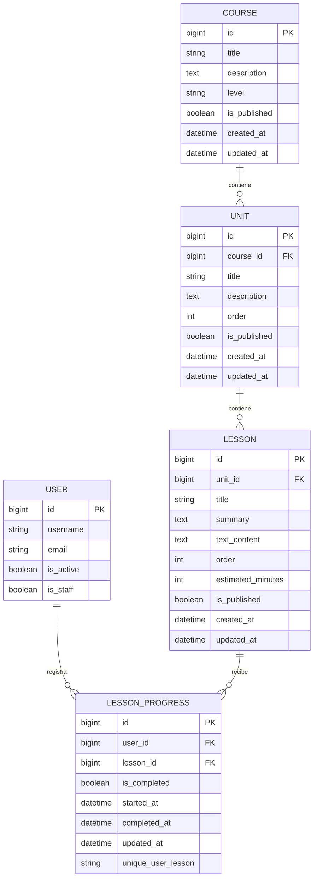
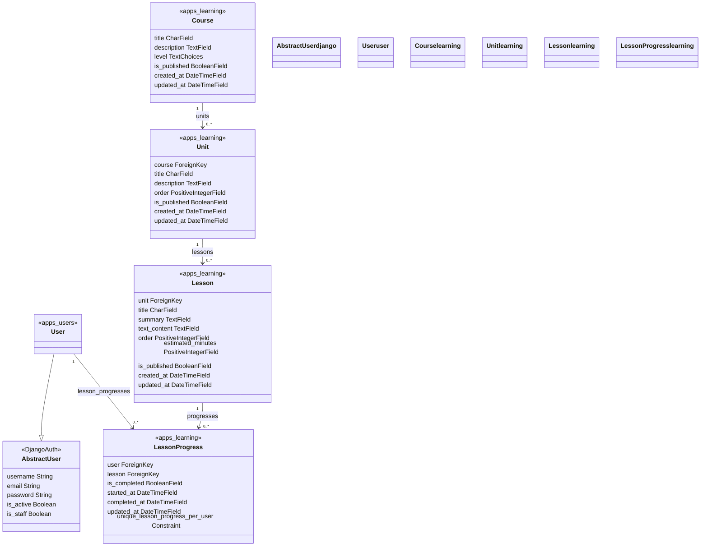
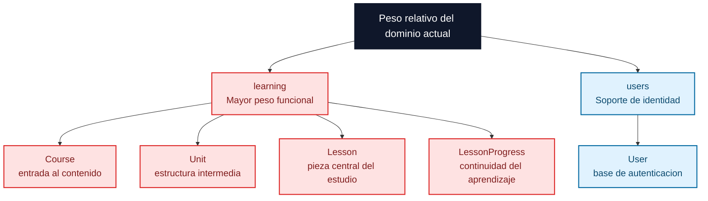

# Diagramas de base de datos

Este documento resume visualmente el modelo de datos actual del proyecto usando solo las entidades que existen hoy en el codigo.

## ERD

Este diagrama entidad-relacion muestra las tablas principales del dominio actual: usuario, cursos, unidades, lecciones y progreso por leccion.

Lectura rapida: la estructura principal del aprendizaje es `COURSE -> UNIT -> LESSON`. El progreso no se guarda dentro de la leccion, sino en `LESSON_PROGRESS`, que conecta a `USER` con `LESSON` y evita duplicados por usuario y leccion.

## Class Diagram

Este diagrama muestra los modelos Django y sus relaciones tal como existen hoy en `users` y `learning`.

Lectura rapida: `User` hereda de `AbstractUser`, mientras `Course`, `Unit`, `Lesson` y `LessonProgress` forman el nucleo del dominio `learning`. Las relaciones del diagrama coinciden con las `ForeignKey` reales del codigo.

## Flowchart de peso relativo

Esta vista opcional reemplaza un treemap clasico por una vista de bloques simple. No mide tamano fisico de tablas, sino peso conceptual dentro del dominio actual.

Lectura rapida: `learning` concentra casi todo el peso funcional del modelo actual porque contiene el recorrido de estudio y el registro de progreso. `users` sigue siendo importante, pero hoy cumple un rol de soporte tecnico y de identidad.

## Limite actual

Estos diagramas muestran solo entidades implementadas hoy. No incluyen `Quiz`, `Certificate`, `Note` u otras piezas futuras porque todavia no existen como modelos reales en el backend.
