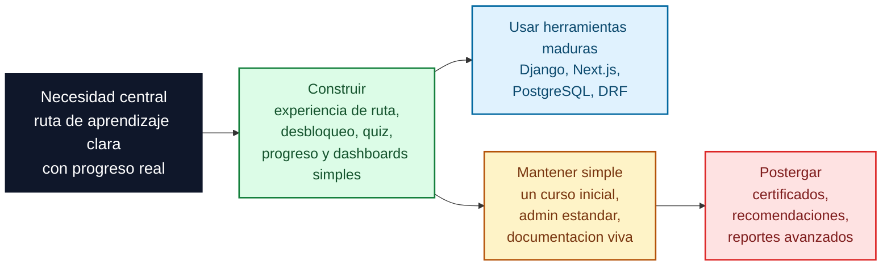
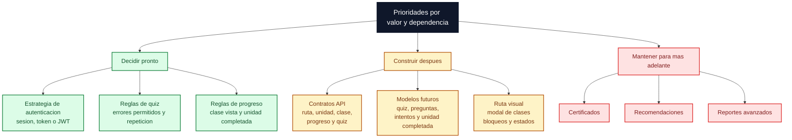
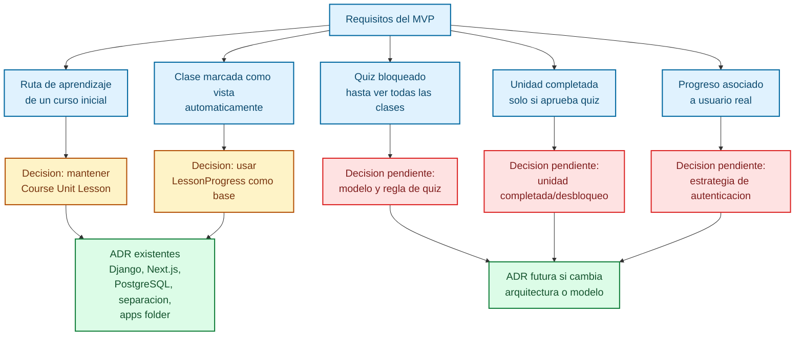
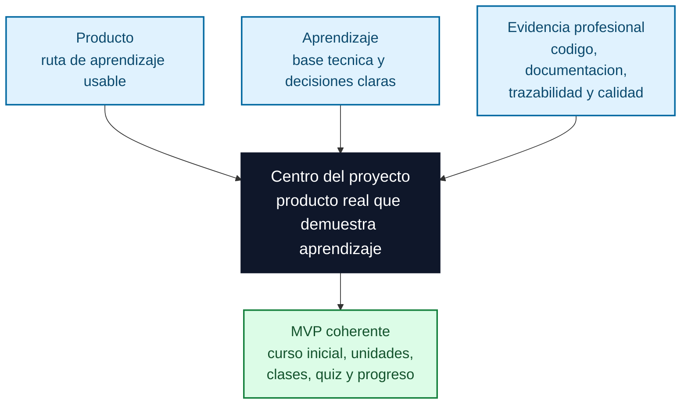

# Diagramas de decisiones

Este documento resume visualmente como las decisiones tecnicas actuales sostienen el producto y que criterios deberian guiar las proximas decisiones.

## Flowchart estrategico de evolucion

Esta vista separa que conviene construir, que conviene usar como herramienta madura y que conviene mantener simple.

Lectura rapida: las decisiones fundacionales ya eligieron herramientas maduras. Las proximas decisiones deberian concentrarse en el valor propio del producto: ruta, avance, quiz y desbloqueo.

## Flowchart de prioridades tecnicas

Lectura rapida: autenticacion, quiz y progreso son decisiones que conviene cerrar antes de construir demasiado frontend, porque condicionan datos, API y experiencia.

## Flowchart de requisitos conectados a decisiones

Lectura rapida: algunas decisiones ya estan cubiertas por ADR existentes. Las proximas ADR deberian aparecer solo si autenticacion, quiz o desbloqueo implican una decision duradera de arquitectura o modelo.

## Flowchart de relacion producto-aprendizaje-evidencia

Lectura rapida: el proyecto funciona mejor cuando producto, aprendizaje y evidencia profesional se refuerzan entre si. Las decisiones tecnicas deben sostener las tres cosas.
