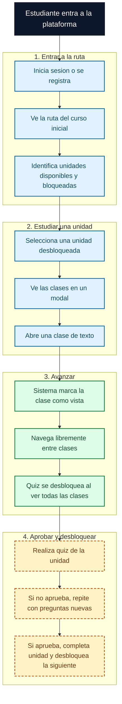
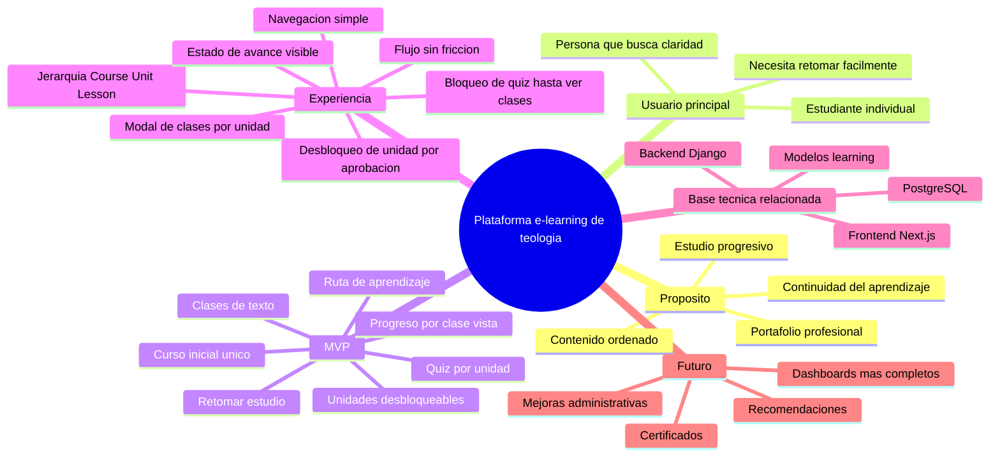
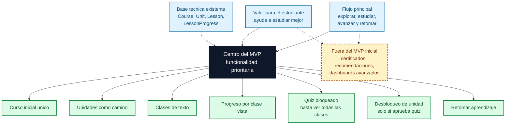
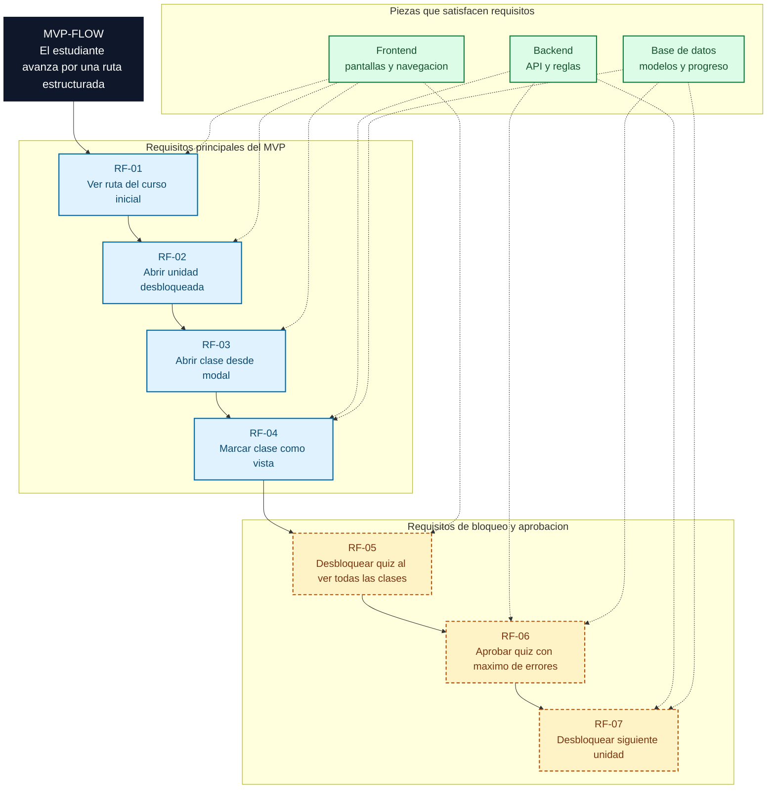

# Diagramas de producto

Este documento resume visualmente la vision funcional del producto y el recorrido principal que deberia soportar la plataforma e-learning.

Los diagramas distinguen entre:

- el MVP objetivo: ruta del curso inicial, unidades, lecciones, progreso por clase y quiz por unidad;
- capacidades futuras: certificados, recomendaciones, dashboards mas completos y funcionalidades avanzadas;
- el flujo de negocio que ayuda a orientar la construccion progresiva.

## Flowchart de recorrido del estudiante

Este recorrido muestra la experiencia esperada de un estudiante desde que entra a la plataforma hasta que avanza en su aprendizaje.

Lectura rapida: el valor principal del producto es que el estudiante no consuma contenido aislado, sino que avance en una ruta clara y pueda retomar sin perder contexto.

## Mindmap

Este mapa resume la vision del producto desde una mirada funcional.

Lectura rapida: el producto no busca ser una biblioteca suelta, sino una experiencia guiada de aprendizaje con estructura, avance y continuidad.

## Flowchart de criterios del MVP

Este diagrama muestra la interseccion de los requisitos principales que hacen que una funcionalidad pertenezca al MVP.

Lectura rapida: una funcionalidad entra bien en el MVP cuando ayuda directamente al estudiante, usa o fortalece la base ya modelada y mejora el flujo principal de aprendizaje. Por eso cursos, unidades, lecciones y progreso son prioridad sobre funciones mas avanzadas.

## Flowchart de requisitos funcionales

Este diagrama representa el flujo de negocio objetivo. Todas las piezas mostradas pertenecen al MVP funcional esperado, aunque quiz, intentos y desbloqueo de unidad todavia requieren modelo, API y reglas de negocio.

Lectura rapida: el flujo de negocio empieza con una ruta unica de aprendizaje y termina con desbloqueo progresivo de unidades. Hoy el modelo `LessonProgress` sostiene parte del avance por clase vista; quiz, intentos y desbloqueo de unidad siguen como piezas necesarias del MVP que deben definirse antes de implementarlas.

## Limite actual

Estos diagramas explican la direccion funcional del producto. No significan que todos los flujos esten implementados. El estado real actual es:

- existen modelos para cursos, unidades, lecciones y progreso por leccion;
- ya existe `GET /api/courses/` como primera lectura de dominio;
- la pagina principal ya muestra cursos publicados, pero todavia no existe la interfaz funcional completa del flujo;
- quizzes, intentos y progreso de unidad son piezas pendientes del MVP objetivo y requieren definicion de modelo, API y reglas de negocio.
