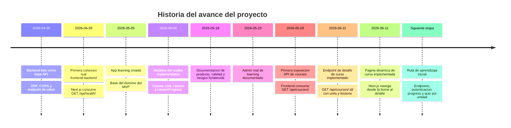
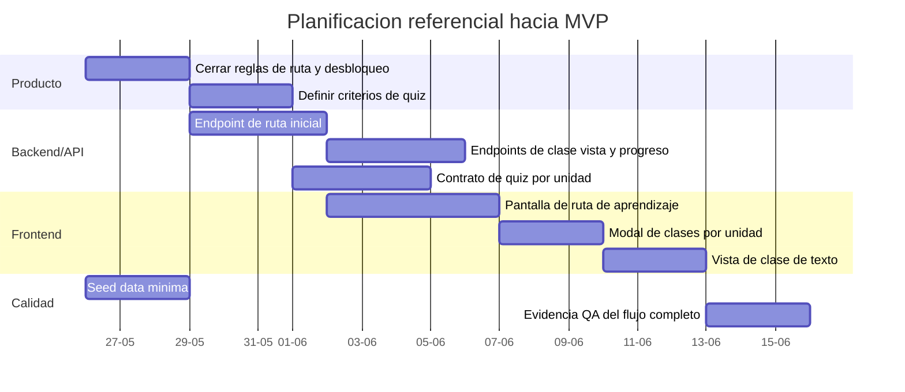
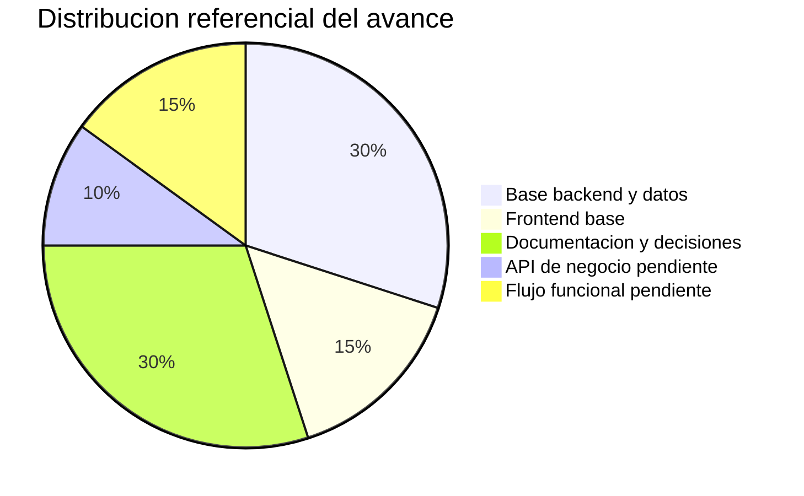
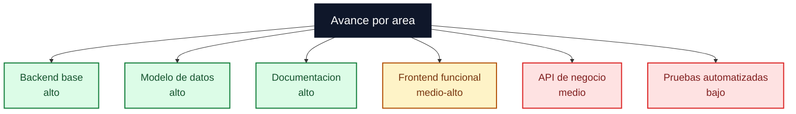
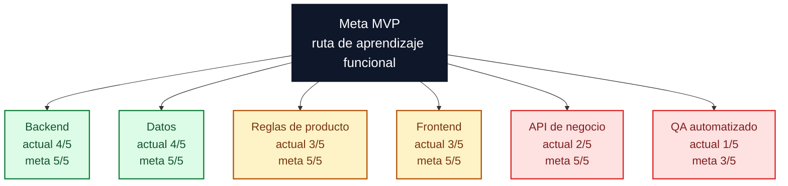

# Diagramas de progreso

Este documento resume avance, planificacion y estado del proyecto. Su objetivo es ayudar a retomar rapidamente el trabajo y ver que falta para llegar al MVP.

## Timeline de avance

Lectura rapida: el proyecto ya salio de la fase de setup inicial y entro en una etapa donde el siguiente valor viene de cerrar un flujo funcional real.

## Gantt de proximas tareas

Lectura rapida: el orden saludable es cerrar reglas, contratos y datos minimos antes de invertir demasiado en UI avanzada.

## Flowchart de tablero de tareas

```mermaid
%%{init: {"themeVariables": {"fontSize": "19px", "fontFamily": "Arial"}}}%%
flowchart LR
  subgraph Todo["Pendiente"]
    T1["Definir login/registro"]
    T2["Modelar quiz e intentos"]
    T3["Definir dashboards iniciales"]
    T4["Preparar seed data del curso"]
  end

  subgraph Doing["En progreso documental"]
    D1["Diagramas por carpeta"]
    D2["Reglas de ruta de aprendizaje"]
    D3["Riesgos y prioridades"]
  end

  subgraph Done["Hecho"]
    H1["Backend Django base"]
    H2["Frontend Next.js base"]
    H3["PostgreSQL conectado"]
    H4["Modelos Course Unit Lesson LessonProgress"]
    H5["GET /api/health/"]
    H6["GET /api/courses/<br/>consumido por frontend"]
    H7["GET /api/courses/:id/<br/>units y lessons anidados"]
    H8["/courses/[courseId]<br/>pagina dinamica en Next.js"]
  end

  Todo --> Doing --> Done

  classDef todo fill:#fef3c7,stroke:#b45309,color:#78350f,font-size:19px,stroke-width:2px
  classDef doing fill:#e0f2fe,stroke:#0369a1,color:#0c4a6e,font-size:19px,stroke-width:2px
  classDef done fill:#dcfce7,stroke:#15803d,color:#14532d,font-size:19px,stroke-width:2px

  class T1,T2,T3,T4 todo
  class D1,D2,D3 doing
  class H1,H2,H3,H4,H5,H6,H7,H8 done
```

Lectura rapida: la base tecnica ya esta lista, pero el flujo de producto todavia necesita contratos, UI, datos iniciales y reglas de avance.

## Pie Chart de avance referencial

Lectura rapida: el avance acumulado esta fuerte en base tecnica y documentacion. El mayor espacio pendiente esta en API de negocio y experiencia funcional.

## Flowchart de avance por area

Lectura rapida: el esfuerzo siguiente deberia concentrarse en cerrar API de negocio, ruta visual y validacion.

## Flowchart radial de madurez actual vs meta MVP

Lectura rapida: para llegar al MVP, el proyecto necesita convertir la base tecnica en flujo real: endpoints, ruta visual, progreso persistente, autenticacion y quiz por unidad.
