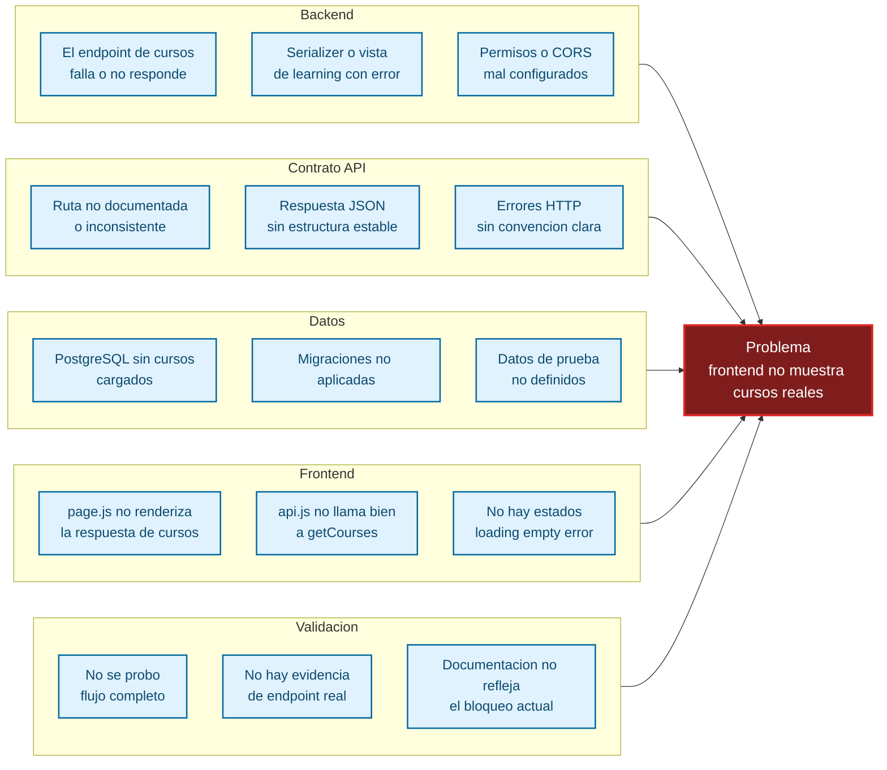
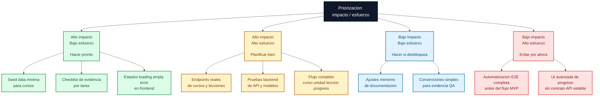
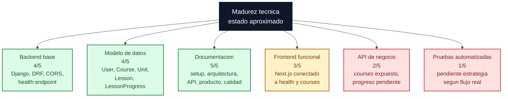

# Diagramas de calidad

Este documento resume visualmente riesgos, validaciones y criterios de calidad para preparar futuras implementaciones de la plataforma.

La idea no es reemplazar las checklists, sino ayudar a decidir que revisar, que priorizar y donde conviene fortalecer el proyecto antes de cerrar nuevas funcionalidades.

## Flowchart de causas

Problema ejemplo: `frontend no muestra cursos reales`.

Este mapa ayuda a diagnosticar causas probables cuando la UI no refleja datos reales del dominio.

Lectura rapida: si el frontend no muestra cursos reales, el problema puede venir de varias capas. Antes de tocar la UI conviene confirmar contrato API, datos reales, migraciones, consumo desde `api.js` y evidencia de validacion.

## Flowchart de matriz impacto/esfuerzo

Esta vista organiza mejoras de calidad segun impacto esperado y esfuerzo relativo.

Lectura rapida: para el siguiente tramo conviene priorizar datos minimos, evidencia QA, estados visibles y endpoints reales. La automatizacion E2E completa puede esperar hasta que el flujo principal exista.

## Flowchart radial de madurez tecnica

Esta vista usa una forma radial. No es una medicion formal: sirve para ver rapidamente que areas estan mas maduras y cuales requieren trabajo futuro.

Lectura rapida: el proyecto esta fuerte en documentacion, backend base y modelo de datos. El foco de calidad para futuras implementaciones deberia moverse hacia API de negocio, frontend con datos reales y pruebas automatizadas proporcionales al riesgo.

## Uso recomendado

Estos mapas se pueden revisar antes de iniciar una funcionalidad grande, especialmente si toca cursos, lecciones, progreso o integracion frontend-backend.

Tambien sirven para cerrar tareas: si aparece un fallo, el flowchart de causas ayuda a buscar origen; si hay varias mejoras posibles, la matriz ayuda a ordenar; si se planifica una etapa nueva, la vista radial ayuda a ver donde falta madurez.
