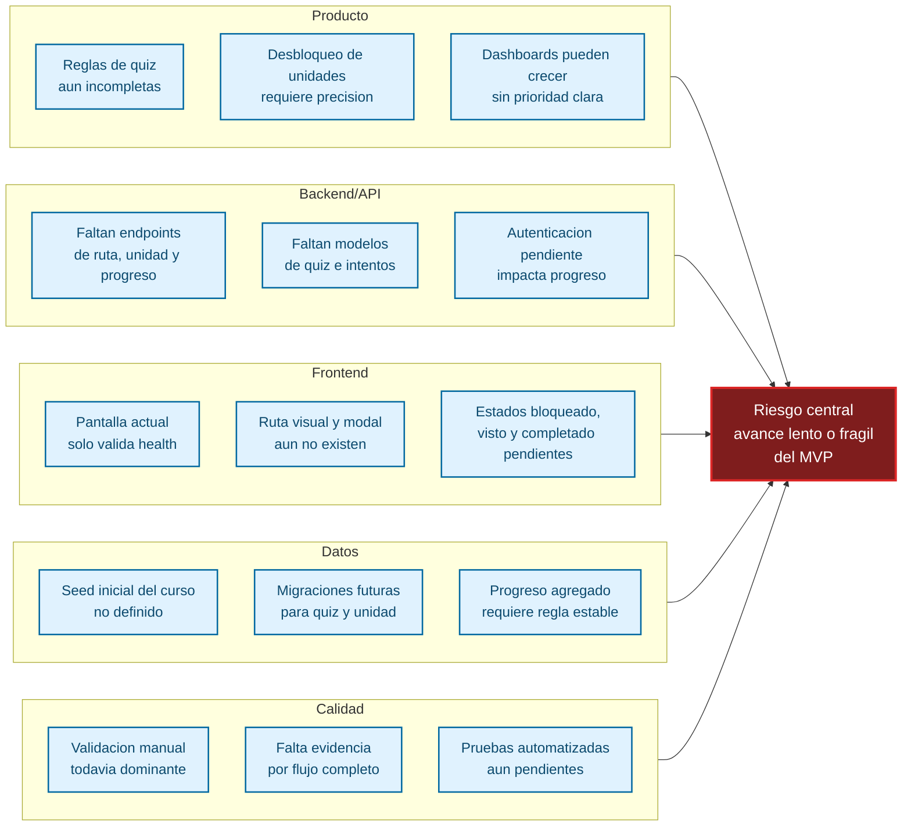
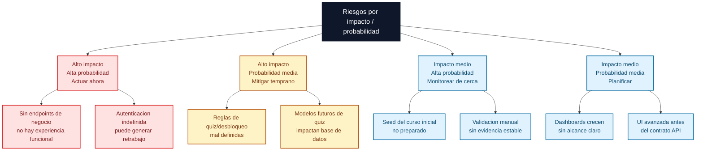
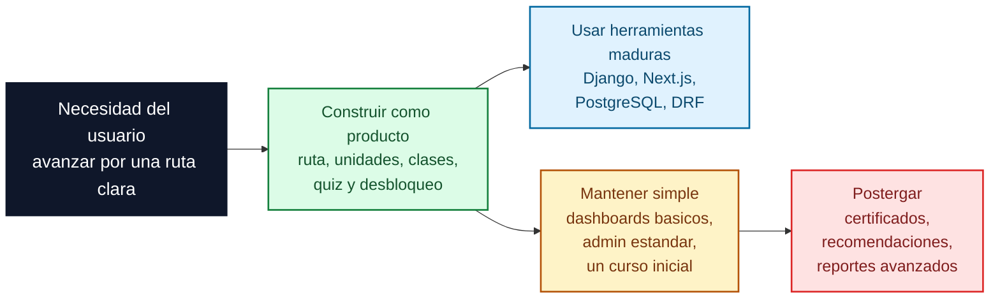

# Diagramas de riesgos

Este documento resume visualmente riesgos tecnicos y de avance del proyecto, pensando en la implementacion pendiente de la ruta de aprendizaje, autenticacion, progreso, quizzes y dashboards.

## Flowchart de causas de riesgos

Riesgo central: avance lento o fragil en el flujo principal de aprendizaje.

Lectura rapida: el mayor riesgo no es una pieza aislada, sino la coordinacion entre reglas de producto, contratos API, persistencia, UI y validacion.

## Flowchart de matriz impacto/probabilidad

Esta matriz ordena riesgos segun impacto y probabilidad para decidir donde actuar primero.

Lectura rapida: conviene actuar primero sobre endpoints, autenticacion y reglas de desbloqueo. Dashboards y UI avanzada deben esperar a que el contrato del flujo principal este mas estable.

## Flowchart estrategico de evolucion

Esta vista separa que construir, que usar como herramienta madura y que mantener simple para no sobrecargar el MVP.

Lectura rapida: el valor diferenciador esta en la ruta de aprendizaje y sus reglas de avance. Conviene usar herramientas maduras para infraestructura y mantener simples las areas que todavia no son el nucleo del MVP.
