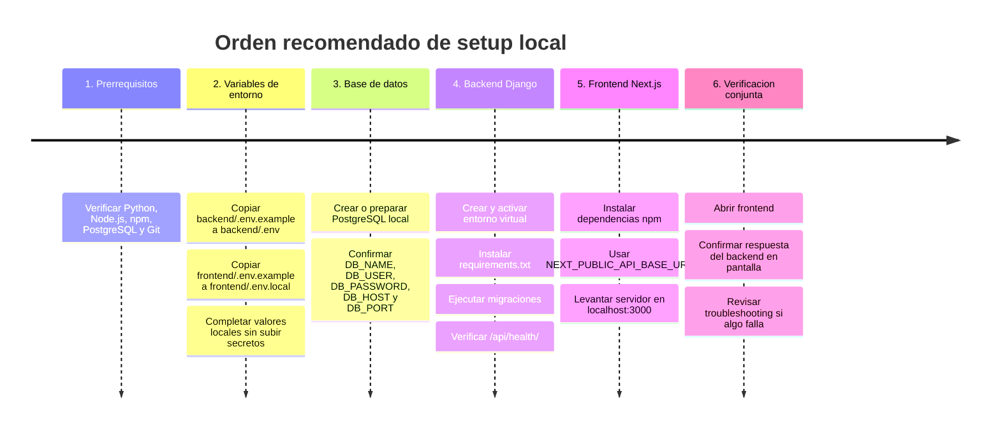

# Diagramas de setup

Este documento resume visualmente como esta organizada la documentacion de setup y cual es el orden recomendado para configurar el proyecto en local.

## Flowchart de archivos principales

Este diagrama muestra los archivos principales que una persona deberia revisar para instalar, configurar y levantar el proyecto.

```mermaid
%%{init: {"themeVariables": {"fontSize": "20px", "fontFamily": "Arial"}}}%%
flowchart TD
  Setup["docs/setup/<br/>Guia de configuracion local"]

  Setup --> Readme["README.md<br/>Mapa de lectura"]
  Setup --> Prereq["prerequisites.md<br/>Herramientas necesarias"]
  Setup --> Env["environment-variables.md<br/>Variables backend y frontend"]
  Setup --> Database["database.md<br/>PostgreSQL y migraciones"]
  Setup --> Backend["backend.md<br/>Entorno virtual, dependencias<br/>y servidor Django"]
  Setup --> Frontend["frontend.md<br/>Dependencias npm<br/>y servidor Next.js"]
  Setup --> Run["run-project.md<br/>Levantar backend y frontend"]
  Setup --> Troubleshooting["troubleshooting.md<br/>Problemas comunes"]

  Env --> BackendEnv["backend/.env<br/>Archivo real no versionado"]
  Env --> BackendExample["backend/.env.example<br/>Plantilla versionable"]
  Env --> FrontendEnv["frontend/.env.local<br/>Archivo real no versionado"]
  Env --> FrontendExample["frontend/.env.example<br/>Plantilla versionable"]

  Backend --> Django["backend/<br/>Django API"]
  Database --> Postgres[("PostgreSQL<br/>Base de datos local")]
  Frontend --> Next["frontend/<br/>Next.js App Router"]
  Run --> Health["/api/health/<br/>Verificacion minima"]

  classDef root fill:#0f172a,stroke:#0f172a,color:#ffffff,font-size:22px,stroke-width:3px
  classDef doc fill:#e0f2fe,stroke:#0369a1,color:#0c4a6e,font-size:20px,stroke-width:2px
  classDef env fill:#fef3c7,stroke:#b45309,color:#78350f,font-size:20px,stroke-width:2px
  classDef app fill:#dcfce7,stroke:#15803d,color:#14532d,font-size:20px,stroke-width:2px
  classDef check fill:#fce7f3,stroke:#be185d,color:#831843,font-size:20px,stroke-width:2px

  class Setup root
  class Readme,Prereq,Env,Database,Backend,Frontend,Run,Troubleshooting doc
  class BackendEnv,BackendExample,FrontendEnv,FrontendExample env
  class Django,Postgres,Next app
  class Health check
```

Lectura rapida: `README.md` orienta la lectura, `environment-variables.md` explica que archivos copiar y completar, `database.md` prepara PostgreSQL, `backend.md` y `frontend.md` levantan cada capa, y `run-project.md` confirma que todo funciona junto.

## Timeline simple de configuracion

Este timeline muestra el orden recomendado para preparar el entorno local. Aunque se trabajen backend, base de datos y frontend como partes separadas, las variables de entorno deben quedar listas antes de ejecutar servicios que dependan de ellas.

Lectura rapida: la configuracion empieza validando herramientas, sigue con variables de entorno y base de datos, luego levanta Django y Next.js, y termina con una verificacion conjunta usando el endpoint de salud.
