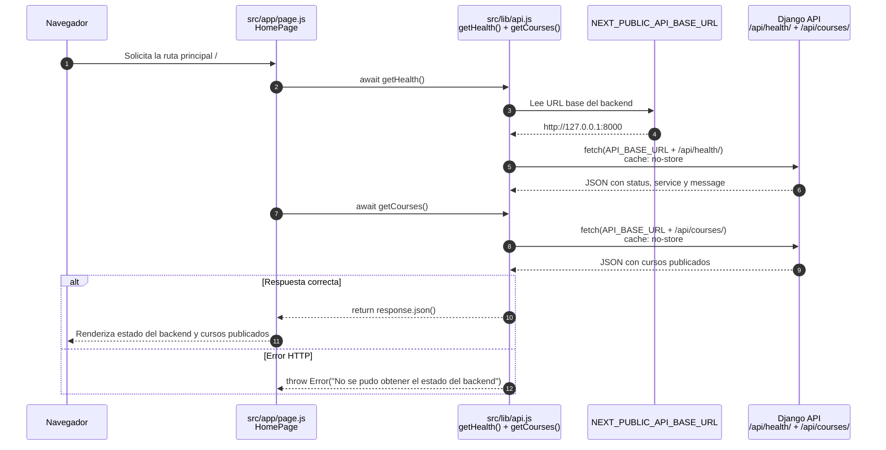
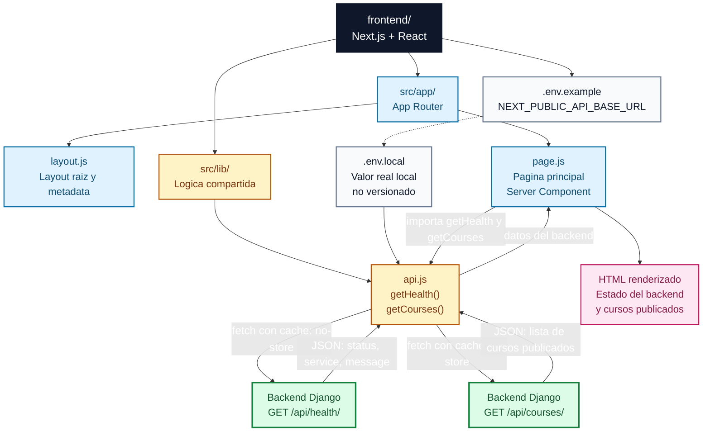

# Diagramas del frontend

Este documento muestra como esta organizado el frontend Next.js y como consume el backend Django en el estado actual del proyecto.

El objetivo es explicar dos cosas concretas:

- como `src/app/page.js` llama a `src/lib/api.js`;
- como `src/lib/api.js` consume `GET /api/health/` y `GET /api/courses/` del backend.

## Sequence Diagram

Este diagrama muestra el flujo real actual de la pagina principal. `HomePage` se renderiza como Server Component y consulta tanto `getHealth()` como `getCourses()` antes de devolver el HTML.

Lectura rapida: `page.js` no construye directamente la URL ni conoce el detalle de `fetch`. Esa responsabilidad queda concentrada en `src/lib/api.js`, que usa la variable de entorno publica para llamar al backend y devolver tanto verificacion tecnica como cursos publicados.

## Flowchart de bloques

Este diagrama muestra los bloques principales del frontend actual y su relacion con Django.

Lectura rapida: `src/app/` define la pantalla visible y `src/lib/api.js` concentra la comunicacion HTTP. El frontend no accede a PostgreSQL ni duplica logica de negocio; consume Django mediante la URL configurada en `NEXT_PUBLIC_API_BASE_URL`.

## Limite actual

Estos diagramas muestran el estado real del frontend. Ya existe una integracion inicial con cursos publicados, pero todavia no existen pantallas funcionales completas de ruta de aprendizaje, autenticacion ni progreso de usuario.
